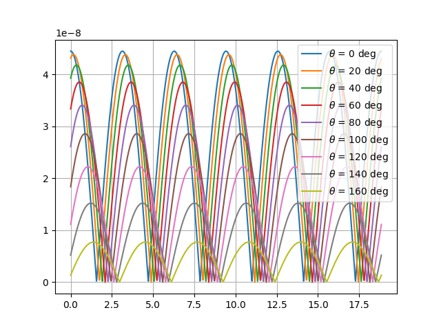

# TIPE 2024-2025

## Calcul de la viscosité d'un fluide à l'aide d'un agitateur magnétique
### "Transformer un agitateur magnétique en viscomètre"

### Simulation : 
#### Actuelle : 

### Equations : 
***
#### Couple retardateur de l'eau
$$N_{hdr} = -kV\eta\omega$$

k : shape factor (k = 17,5?)  
V : volume de l’agitateur   
ղ : viscosité ♥   
ω : vitesse angulaire

 - V en immergeant l’agitateur dans un récipient d’eau (type éprouvette graduée)
 - ω en faisant un pointage par exemple
 - k avec un liquide de référence de viscosité connue (comme l’eau)

***
couple magnétique : Dipôle [lien](https://en.wikipedia.org/wiki/Magnetic_moment#Magnetic_pole_model)

***
#### Moment magnétique :
$${\displaystyle \mathbf {B} ({\mathbf {r} })=\nabla \times {\mathbf {A} }={\frac {\mu _{0}}{4\pi }}\left[{\frac {3\mathbf {r} (\mathbf {m} \cdot \mathbf {r} )}{r^{5}}}-{\frac {\mathbf {m} }{r^{3}}}\right].}$$
[source](https://en.wikipedia.org/wiki/Magnetic_dipole)

non résolvable par le calcul direct mais déterminable par expérimentation : 
on mesure B avec un teslamètre en déplaçant le capteur perpendiculairement au moment (du barreau et ou agitateur magnétique) (ce qui va enlever le terme m scalaire r) on a ainsi B proportionnel à m, on trace la droite et on obtient m

***
## Liens

[agitateur intelligent](https://wrap.warwick.ac.uk/id/eprint/184482/1/WRAP-real-time-rheological-monitoring-smart-stirrer-2024.pdf)
  [cellule magnetique](https://www.cell.com/action/showPdf?pii=S0006-3495%2887%2983243-5)
